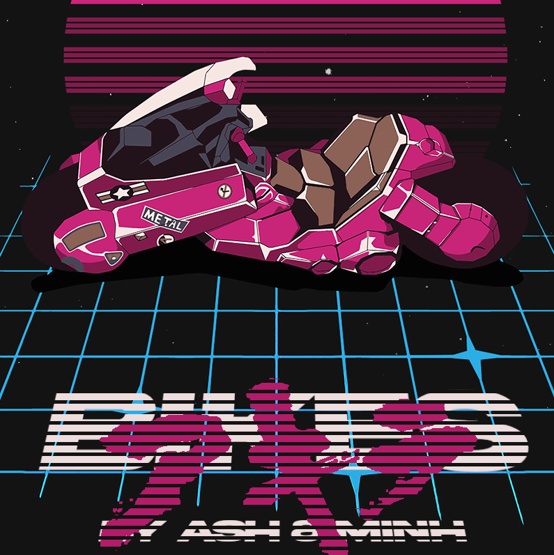

<!-- PROJECT LOGO -->
 

  

<h3 align="center">Bikes Game</h3>
  

    Bikes: ein mittels JavaFX entwickeltes Spiel im Modul "Verteilte Systeme"

<!-- ABOUT THE PROJECT -->
## Über das Projekt

<!--![Start Screen][screenshot-start]-->

<!--TECHNOLOGIEN -->
## Entwickelt mit

* [![Java][Java-Image]][Java-Website]
* [![Intellij][Intellij-Image]][Intellij-Website]

<!-- AUFBAU -->
## Aufbau der Anwendung

TODO: Bilder des Spiels

# Dokumentation
Folgend unsere Dokumentation im ARC42 Format

## Applikation Dokumentation
https://docs.google.com/document/d/1uQOmVqTH9rWMb6WobUsblHNTH9qsjsBAAprnFUHID0s/edit?usp=sharing

## Middleware Dokumentation
https://docs.google.com/document/d/1Ar15ffd7TIyKSRW3cRgJCCv-xHf37l_-0_nhgFoz3Pc/edit?usp=sharing

<!-- MEINE LINKS -->
<!-- https://www.markdownguide.org/basic-syntax/#reference-style-links -->

[Java-Website]: https://www.java.com/de/
[Intellij-Website]: https://openjfx.io/](https://www.jetbrains.com/de-de/idea/

<!-- MEINE BILDER -->
[Bikes-Logo]: images/logo.png
[Java-Image]: https://img.shields.io/badge/java-%23ED8B00.svg?style=for-the-badge&logo=openjdk&logoColor=white
[Intellij-Image]: https://img.shields.io/badge/IntelliJIDEA-000000.svg?style=for-the-badge&logo=intellij-idea&logoColor=white

